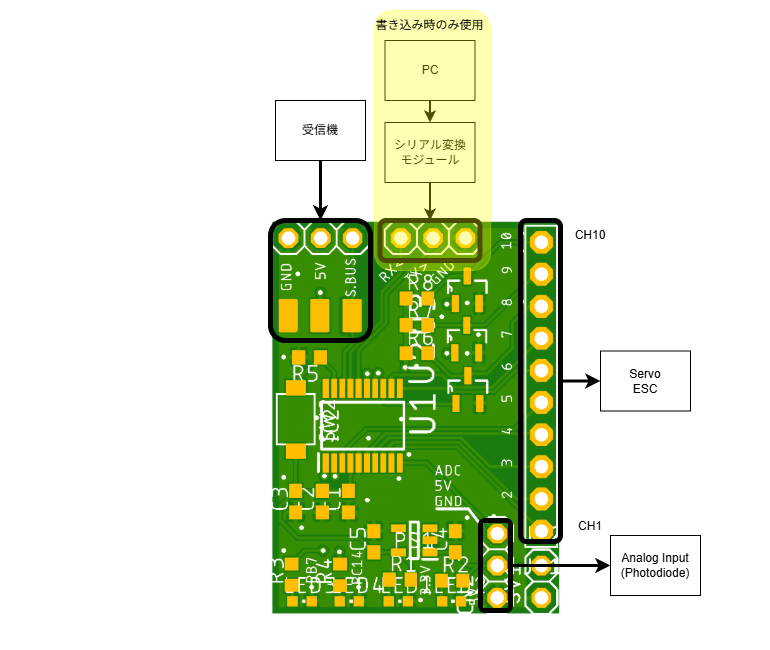
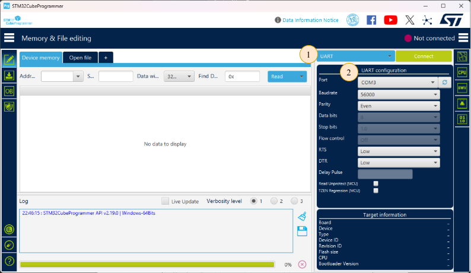
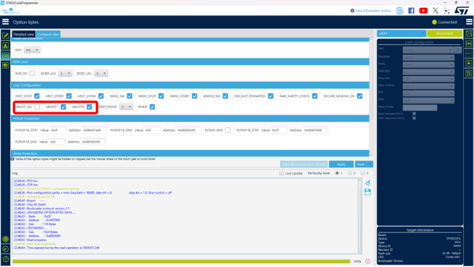
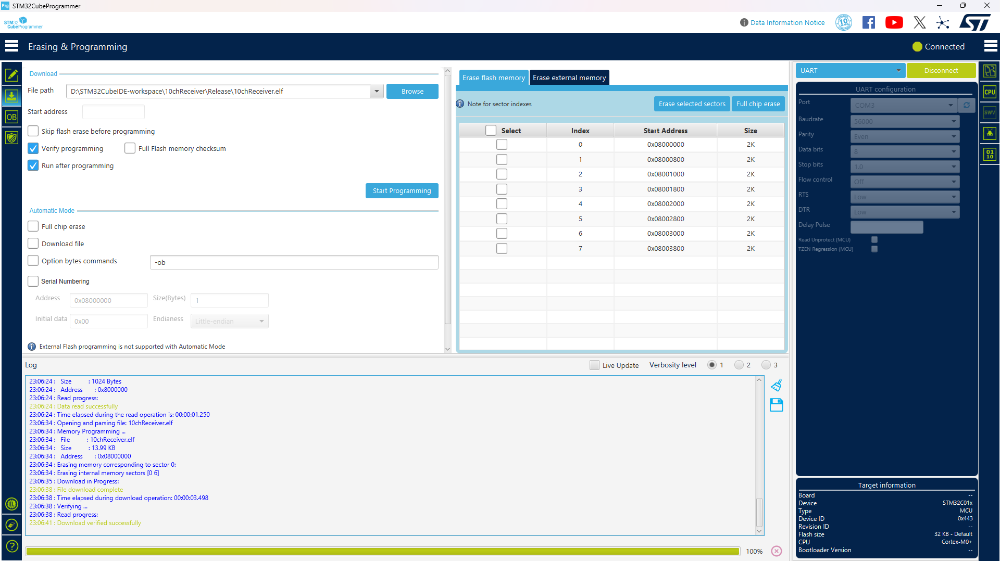

# 10ch受信機と呼ばれる基板
本システムはs.busを読み取り最大10chのPWMを出力するものである．
一般的なFutaba製受信機では，6ch程度のものが多くまたチャンネル数を増やすと重量が増加する問題があった．
Futaba製受信機で最軽量なものはR3206SBMで公称1g以下であり，s.busと6chのPWM出力が可能である．実用時にはサーボやESCへの電源の分配を外部で行う必要があり4g程度である．その他の受信機は6chで8g，8chで10g程度となっている．

安全を考慮した本システムであっても10chで8g程度に収まる軽量なものである．
また，より軽量なバージョンでは6g程に収まる見込みである．

# 使い方
## 基板の解説
受信機やESC，サーボなどの接続図を示す．

受信機は図上方のピンヘッダーのうち左側3ピンを使用する．
ピン配置は左からGND，5V，S.Busである．

図右側にはESC,サーボ向けのPWM出力をするピンが10ch分ある．
図下側から順に1ch - 10chである．
従来の受信機と同様にESCを接続すると基板に電源が供給される．

図左側のPC及びシリアル変換モジュールはマイコンのプログラムの書き込みに使用する．
ピンヘッダーのピン配置は上からシリアル通信のRXとTX,GND,3.3V，BOOTである．
3.3Vに電源を接続する際は基板に5Vを入力してはならない．
シリアル通信のRC，TXはいずれもマイコンのRX，TXピンに接続されている．
RXピンに信号を入力し，TXピンから信号が出力される．

基板の裏側にはタクトスイッチが1つとLEDが4つある．
LEDはPWM用のピンヘッダーに近い方から順に，3.3Vと5Vの電源確認および2つのマイコンの状態確認用である．状態確認用のLEDをPWM用のピンヘッダーに近い方から順に，LED1およびLED2とする．

## PCとの接続
プログラムの書き込みには[STM32CubeProgrammer](https://www.st.com/ja/development-tools/stm32cubeprog.html)を使用する．
STのwebページより最新版をダウンロードし，インストールすることを推奨する．

使用するものはPCとシリアル変換モジュール，5V電源供給のためのLiPoおよびESCである．
まず，シリアル変換モジュールと基板でシリアル通信の信号線 (RX,TX)とGNDを接続する．
その後，基板裏側のタクトスイッチを押しながら5Vを接続する．
最後にPCとシリアル変換モジュールを接続する．

STM32CubeProgrammerを用いてマイコンに接続する．
まず，マイコンとの接続方法をUARTに設定する．
その後，UARTの設定を行う．
ポートは環境によって異なるので，各自の環境においてシリアル変換モジュールのポートを選択する．
ボーレートは経験的に56000以下で選択するとよい．
その他の項目は特に設定する必要はない．
以上ができたらconnectする．
エラーが出た際はエラーメッセージを確認して対処する．
よくあるトラブルは基板の電源投入時にスイッチを上手く押せていないことなので，電源を入れ直すと解決することがある．

## 初回セットアップ
ここでは，マイコンのプログラムに依存しない部分の設定をおこなう．
このステップを正しく実行しないと，プログラムの書き直しが不可能になるので確実に行う．

画面左のメニューから**OB**(Option bytes)を選択する．
**User Configuration**にある**nBOOT_SEL**および**nBOOT1**，**nBOOT0**のチェックが画像と同じになるように設定する．

以上でセットアップは完了である．

## プログラムの更新
画面左のメニューよりErasing & Programmingを選択する．
File Pathで実行ファイル (10chReceiver.elf) を選択する．
**Verify programming**と**Run after programming**にチェックを入れる．
**Start Programming**をクリックして，書き込みを開始する．
処理が終了し，Logに`Download verified successfully`と表示されていれば正常終了である．

実行ファイルはGithubのリリースよりダウンロードするか，ソースファイルをビルドすることで作成してください．

## LEDの点滅パターン
プログラム起動時にLED1とLED2が点灯し起動処理が完了すると消灯するが，点灯時間がごく短時間であるため確認できないと思われる．
s.busのフレームを受信している間はLED2が高速で点滅する．
受信データがフェイルセーフもしくはフレームロストを示していたり，正常にデータを処理できない状態が続くとLED1がゆっくり点滅する．
また，s.busの受信ができない状態となったときもLED1がゆっくり点滅する．
したがって，LEDの点灯パターンを用いておおよそ下記のように判断できる．

|LED1|LED2|Stat|
|:--:|:--:|:--:|
|消灯 / 点灯|点滅|正常|
|点滅|消灯 / 点灯|基板-受信機の接続に問題がある|
|点滅|点滅|受信機-プロポの通信に問題がある|
